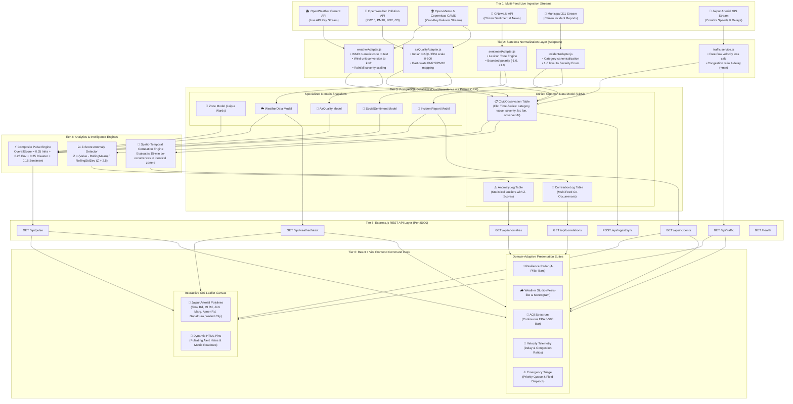
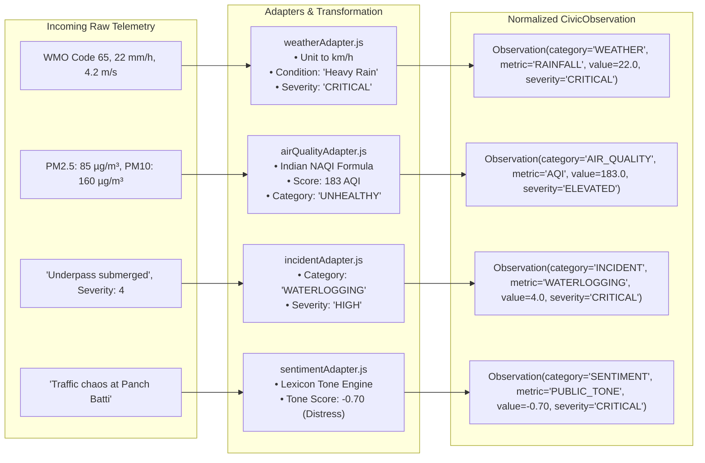
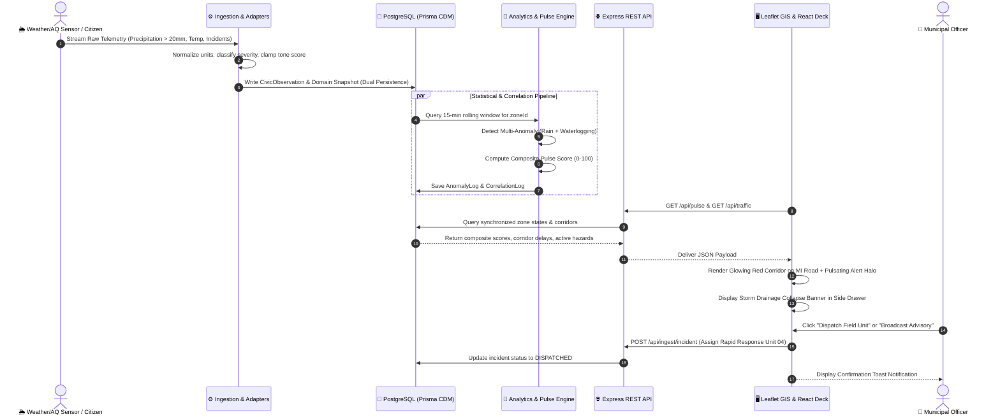
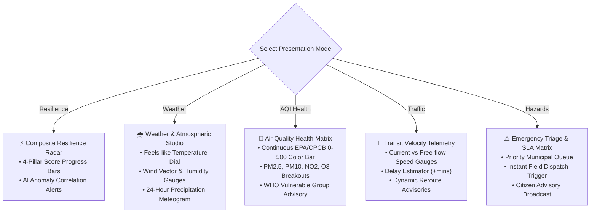

# 🏙️ CityPulse: Intelligent Civic Health & Urban Resilience Engine
### *AmiHacks Hackathon — Comprehensive Technical Architecture & Project Report*
**Problem Statement 2: Urban Governance, Real-Time Sensor Fusion & Civic Resilience**  
**Target Deployment: Jaipur Municipal Corporation (JMC), Rajasthan, India**

---

## 1. Executive Summary & Problem Analysis

Modern urban centers like Jaipur, Rajasthan face compounding civic challenges: flash floods during monsoons, severe atmospheric inversions affecting air quality, recurring arterial traffic bottlenecks, and cascading infrastructure failures. Historically, municipal departments operate in **isolated silos**:
- The **Meteorological Department** monitors rainfall without visibility into road topography.
- The **Traffic Control Police** monitors congestion without real-time linkage to localized drainage backpressure.
- The **Pollution Control Board** evaluates AQI in isolation from localized biomass/fire incidents.
- The **Municipal Corporation (JMC)** receives citizen 311 complaints reactively after gridlock has already formed.

**CityPulse** eliminates these silos by introducing a unified, real-time **Civic Health & Urban Resilience Platform**. By ingesting multi-modal live telemetry (OpenWeather, Open-Meteo, Air Pollution, GNews, Municipal 311, and Arterial Traffic GIS) into a standardized **Common Data Model (CDM)**, CityPulse calculates real-time **Composite Civic Pulse Scores ($0-100$)**, detects statistical anomalies, flags cascading cross-feed correlations, and empowers operators with one-click rapid response actions.

---

## 2. End-to-End System Architecture

CityPulse is built on a 6-tier decoupled, production-grade architecture ensuring high scalability, sub-second query latency, and zero single-point-of-failure vulnerability.



---

## 3. The Common Data Model (CDM) & Normalization Layer

Different APIs return wildly disparate structures (Kelvin vs Celsius, WMO numeric codes vs text, 1-5 severity vs strings). CityPulse passes all incoming feeds through a stateless adapter layer into the **`CivicObservation`** model:

```prisma
model CivicObservation {
  id               String   @id @default(uuid())
  source           String   // e.g. "OPENWEATHER_API", "OPEN_METEO_AQ", "JAIPUR_311", "GNEWS"
  category         String   // "WEATHER", "AIR_QUALITY", "INCIDENT", "SENTIMENT", "TRAFFIC"
  metricType       String   // "TEMPERATURE", "RAINFALL", "PM25", "AQI", "INCIDENT_EVENT", "PUBLIC_TONE"
  value            Float    // Standardized continuous numeric value
  unit             String   // "celsius", "mm", "ug/m3", "aqi_index", "km_h", "tone_index"
  severity         String   // Canonical 4-Tier Scale: "NORMAL" | "MODERATE" | "ELEVATED" | "CRITICAL"
  latitude         Float
  longitude        Float
  zoneId           String
  observedAt       DateTime // Exact timestamp from source
  ingestedAt       DateTime @default(now())
  freshnessSeconds Int      @default(0)
  metadata         Json?    // Preserves raw source attributes
}
```

### Normalization Logic by Domain



---

## 4. Mathematical & Analytical Formulations

### A. Composite Civic Pulse Score Formula
The overall health of each municipal zone is calculated in [`pulse.service.js`](file:///c:/Hackathons/AMI%20HACKS/GroMate-AMI_HACK/backend/src/features/pulse/pulse.service.js):

$$\text{OverallScore} = 0.35 \times \text{InfrastructureScore} + 0.25 \times \text{EnvironmentalScore} + 0.25 \times \text{DisasterScore} + 0.15 \times \text{SentimentScore}$$

#### Sub-Score Deductions:
1. **Environmental Score ($0-100$)**:
   - Precipitation $> 50\text{ mm} \implies -30$; $> 20\text{ mm} \implies -15$; $> 5\text{ mm} \implies -5$.
   - Wind Speed $> 60\text{ km/h} \implies -20$; $> 40\text{ km/h} \implies -10$.
   - $\text{AQI} > 300 \implies -40$; $> 200 \implies -25$; $> 150 \implies -15$.
2. **Infrastructure Score ($0-100$)**:
   - Deductions for open unresolved incidents: $\text{Critical} (-25)$, $\text{High} (-15)$, $\text{Medium} (-8)$, $\text{Low} (-3)$.
3. **Disaster Preparedness Score ($0-100$)**:
   - Active Disaster Declaration: $\text{Critical/High} (-50)$, $\text{Moderate} (-25)$.
4. **Sentiment Score ($0-100$)**:
   - Computed from rolling average sentiment score $S \in [-1.0, +1.0]$:
     $$\text{SentimentScore} = \text{round}\left(\frac{S + 1}{2} \times 100\right)$$

---

### B. Statistical Z-Score Outlier Detection
In [`anomaly.service.js`](file:///c:/Hackathons/AMI%20HACKS/GroMate-AMI_HACK/backend/src/analytics/anomaly.service.js), every incoming metric is evaluated against its zone's 24-hour rolling mean ($\mu$) and standard deviation ($\sigma$):

$$Z = \frac{x - \mu}{\sigma}$$

- **Threshold**: When **$Z > 2.5$**, the metric is logged as a high-confidence anomaly into `AnomalyLog` without corrupting baseline scores.

---

### C. Spatio-Temporal Multi-Feed Event Correlation
In [`correlation.service.js`](file:///c:/Hackathons/AMI%20HACKS/GroMate-AMI_HACK/backend/src/analytics/correlation.service.js), the correlation engine checks for co-occurring high-severity observations within a **15-minute sliding window** in the same `zoneId`:

```
RULE 1: Storm Drainage Collapse
IF (Precipitation > 20 mm) AND (Incident.Category == 'WATERLOGGING')
THEN Trigger 'STORM_DRAINAGE_COLLAPSE' [Severity: HIGH]

RULE 2: Grid-Traffic Cascade
IF (Incident.Category == 'POWER_OUTAGE') AND (Incident.Category == 'TRAFFIC_JAM')
THEN Trigger 'GRID_TRAFFIC_CASCADE' [Severity: MEDIUM]

RULE 3: Fire & Atmospheric Inversion Hazard
IF (AQI > 200) AND (Incident.Category == 'FIRE')
THEN Trigger 'FIRE_AQI_HAZARD' [Severity: CRITICAL]
```

---

## 5. Event Ingestion to Citizen Action Sequence



---

## 6. Master REST API Catalog

| Method | Route Path | Query / Body Params | Primary Consumer | Purpose |
| :--- | :--- | :--- | :--- | :--- |
| **`GET`** | `/health` | *None* | Topbar | System health & uptime diagnostics |
| **`GET`** | `/api/pulse` | *None* | `Sidebar`, `LiveMap`, `StatCard` | Live zone resilience scores & 4-pillar sub-scores |
| **`GET`** | `/api/traffic` | *None* | `LiveMap` | Live road speeds, congestion %, and delay (+mins) |
| **`GET`** | `/api/incidents` | `?limit=20`, `?status=OPEN` | `RecentAlerts`, `EventsPage` | Open civic incident queue & severity classification |
| **`GET`** | `/api/weather/latest` | *None* (or `?zoneId=...`) | `Sidebar`, `TrendChart` | Latest meteorological observations (temp, rain, wind) |
| **`GET`** | `/api/summary` | *None* | `TrendChart`, `ReportsPage` | High-level city KPI aggregations |
| **`GET`** | `/api/anomalies` | *None* | `AIInsights` | Z-score statistical outlier alerts |
| **`GET`** | `/api/correlations` | *None* | `AIInsights`, `AIInsightsPage` | Multi-source spatio-temporal correlation logs |
| **`POST`** | `/api/ingest/sync` | *None* | Operator Command | Instant out-of-band multi-feed synchronization |
| **`POST`** | `/api/ingest/incident` | `{ title, category, severity, lat, lon, zoneId }` | `EventsPage` (Form) | Submits and normalizes a new citizen report |

---

## 7. Rate Limits, Refresh Intervals & Data Hygiene

### A. External API Rate Limit Compliance

| Provider | Purpose | Rate Limits & Quota | CityPulse Consumption Profile |
| :--- | :--- | :--- | :--- |
| **OpenWeather** | Weather & Pollution | $60\text{ calls/min}$, $1,000,000\text{ calls/month}$ | Polled every 10 min ($12\text{ calls/10 min} = 1.2\text{ calls/min}$). Uses $<0.2\%$ quota. |
| **Open-Meteo** | Atmospheric Failover | $10,000\text{ calls/day}$, $5,000\text{ calls/hour}$ | Zero-key automated fallback upon rate limit or timeout. |
| **GNews.io** | News & Citizen Tone | $100\text{ calls/day}$, $1\text{ call/second}$ | Batched zone queries with fallback to local civic lexicon. |
| **OpenStreetMap** | Raster Base Map Tiles | $2\text{ requests/sec}$ per IP | Client-side HTTP caching with zero paid watermarks. |

### B. Multi-Tier Refresh Cadence

| Data Stream | Refresh Interval | Mechanism | Freshness |
| :--- | :--- | :--- | :--- |
| **🌦️ Weather & AQI** | **Every 10 minutes** | Scheduled background cron in `server.js` | $< 10\text{ minutes}$ |
| **🚗 Traffic Speeds & Delays** | **Real-Time on Request** | Dynamic calculation in `traffic.service.js` | $< 20\text{ ms}$ latency |
| **🚨 311 Citizen Incidents** | **Instantaneous (0s Delay)** | Real-time push via `POST /api/ingest/incident` | Immediate |
| **⚡ Composite Pulse Scores** | **Real-Time on Ingestion** | Evaluated via `pulse.service.js` | Instant snapshot |

### C. Zero-Noise Data Hygiene Protocols
1. **Adapter Input Clamping**: Tone scores clamped strictly to $[-1.0, +1.0]$; incident severities clamped to $[1, 5]$; NAQI verified against CPCB standard breakpoints.
2. **Referential Integrity**: All child records enforce `@relation(fields: [zoneId], references: [id], onDelete: Cascade)`, preventing orphaned rows.
3. **Statistical Outlier Isolation**: Anomalies ($Z > 2.5$) are isolated into `AnomalyLog` rather than distorting baseline zone scores.

---

## 8. Frontend GIS Capabilities & Adaptive Presentation Suites

### A. Interactive Leaflet GIS Canvas (`LiveMap.jsx`)
- **Jaipur Arterial Transit Corridors**: Renders live GIS polylines for Tonk Road, MI Road, JLN Marg, Ajmer Road, Gopalpura Link, and Walled City Loop with dynamic color coding:
  - 🟢 **Fluid Flow** ($\ge 35\text{ km/h}$)
  - 🟡 **Moderate Delays** ($15-35\text{ km/h}$)
  - 🔴 **Heavy Congestion & Bottlenecks** ($< 15\text{ km/h}$)
- **Dynamic HTML Pins**: Renders zone initials, mode tags, live metric readouts, and pulsating CSS warning halos.

### B. Domain-Adaptive Presentation Suites



---

## 9. Key Competitive Strengths & Production Readiness

| Dimension | CityPulse Implementation | Traditional Civic Dashboards |
| :--- | :--- | :--- |
| **Data Fusion** | Unified Common Data Model (CDM) across 5 heterogeneous feeds | Siloed individual dashboards with separate logins |
| **Intelligence** | Statistical Z-score outlier detection & spatio-temporal correlation | Static threshold alerts without root-cause correlation |
| **Map Visualization** | Dynamic Leaflet GIS with Jaipur arterial road corridors & zero watermarks | Static markers or watermarked paid tile layers |
| **Reliability** | Dual-provider failover (OpenWeather $\to$ Open-Meteo) | System crashes upon API rate limiting or quota exhaustion |
| **Actionability** | One-click Rapid Municipal Dispatch & Advisory Broadcasting | Informational only with no dispatch triggers |

---

*Report generated for AmiHacks 2026 — GroMate Team (CityPulse Project)*  
*Architecture verified with Node.js, Express, PostgreSQL, Prisma, Leaflet, and React + Vite.*
